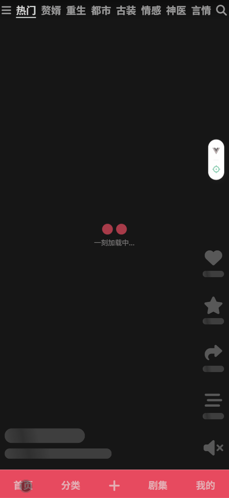
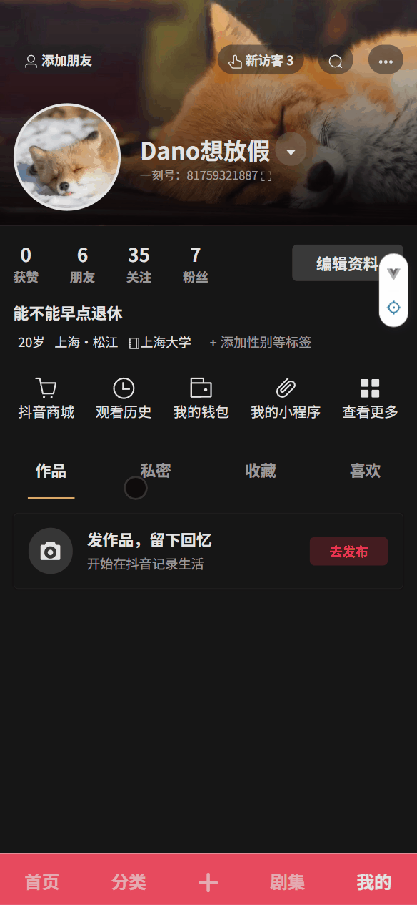

<div align="center">

 

# 一刻短剧

       

</div>

### 项目地址

[一刻短剧：](https://danoandholidays.github.io/yike/)https://danoandholidays.github.io/yike/ _推荐使用移动设备打开_

### 项目介绍

> 一个高仿抖音的**短剧SPA应用**。复刻了核心交互，在性能优化、数据架构、工程化层面进行了实践探索

**一刻短剧** 基于Apifox公开项目 **「悦享好剧」** 开发，仅做学习研究使用。由于短剧竖屏播放，所以全面**模仿抖音**，专注于短剧的竖屏播放体验，前端界面将模仿抖音的交互与视觉风格。也算是我之前开发的网站 [PLAYLET-APP](https://danoandholidays.github.io/PLAYLET-APP/) 的二次开发。之前的项目，原生开发功能全靠手撸，所以有很多问题和没有写完的部分，我也不打算改了，直接重新写一个。

- 若有Bug请发邮件或在GitHub中提出issue。

### 功能实现

- 「首页」类抖音滑动加载。观看记录、收藏与喜欢（存储于本地
- 「分类」短剧分类
- 「上传」调用摄像头，记录生活（暂未实现
- 「剧集」剧集信息、选集信息与观看信息、详情页
- 「我的」静态的个人信息展示

<p align="center">
  
  
  
  
</p>
（有展示GIF，可能加载较慢）

### 项目亮点

#### 一、架构设计：

- **技术栈**：采用 `Vue 3` + `Pinia` + `Vite` + `Sass` + `ElementPlus` + `TS`构建
- **组件化与抽象能力**：
  - **核心播放器组件化**：将复杂的视频播放与交互逻辑（手势处理、队列管理）封装成独立组件，并通过 Props/Events 实现与业务逻辑的解耦，体现了组件的高内聚、低耦合
  - **通用组件复用**：剧集选择、分享等功能均基于同一套抽屉组件扩展，通过灵活的插槽和状态注入，实现了UI与逻辑复用
- **持久化状态管理**：
  - 使用 `Pinia` 并配合持久化插件，构建了完整的客户端数据模型，管理了用户、剧集、播放记录等多维度状态。发现插件不能默认无法序列化 `Set/Map` 的问题，通过自定义或转换，确保了复杂数据结构的存储。

#### 二、核心实现：

- **滑动容器**：
  - **解决方案**：自主实现基于触摸/滚轮事件的监听与节流处理，动态计算位移并控制视频切换，实现了丝滑流畅的仿抖音体验
- **维护视频队列与预加载策略**：
  - **设计思路**：维护一个固定长度的播放队列（如5条），实现“播一预一”的机制。监听滑动行为，动态销毁不可见视频、预加载待播放视频，并触发下一批数据的请求。

#### 三、工程化：

- **完整的CI/CD流水线**：通过 GitHub Actions 实现了简单的Push部署的自动化流程
- **性能优化**：
  - **路由级懒加载**：通过实验验证了懒加载对首屏时间的优化效果，并最终采纳
  - **事件优化**：对滑动、滚轮等高频事件合理应用防抖与节流，确保了性能敏感场景下的页面流畅度。
  - 采用 `<KeepAlive>` 与 `<Transition>` 组合，实现了页面和组件的状态缓存与无缝过渡，提升了应用的质感。
- **核心工具函数使用TS类型重写**：保证调用时的稳定、减少维护成本

#### 四、用户体验：

- **多模式播放路径设计**：通过复用首页的滑动播放组件，设计“随机”与“追剧”两种用户场景，并通过统一的剧集抽屉和详情页进行串联
- **跨端交互适配**：移动优先，为桌面端也提供了键盘、滚轮等交互支持（可能会有Bug

> 「一刻短剧Yike」应该算是我第一次系统地独立完成的一个功能完整的项目，虽然技术难点不够亮眼，没有高大上的技巧，但也算是一个真正的开始，从最开始的“模仿界面”，到一个具有我自己UI/UX设计风格的APP，经历一个多月的时间，学会了很多，我也会持续的将新学的知识应用于此项目...

---

### API与请求库

基于Apifox悦享好剧开发（希望项目一直开放...）但仅有短剧相关、分类的部分。使用Axios发送请求

### 部分适配问题

- 适配绝大多数的桌面浏览器，推荐在浏览器中开启**开发者模式**（按F12）并切换**设备仿真**为安卓机型，体验移动端效果
- 目前部分苹果机型不能自动播放

---

### 项目路线图

1.  **第一阶段 (核心体验)**：实现基于Video.js的单视频播放器，验证服务器Range请求与拖拽功能。✅
2.  **第二阶段 (核心交互)**：开发上下滑动的容器组件，实现视频的切换逻辑与基本预加载。（重难点）✅
3.  **第三阶段 (优化与扩展)**：完善UI细节（加载状态、错误处理）、用户系统（点赞、收藏）、剧集选择等功能。✅

---

## 开发日志与碎碎念

### 8.24.25

最开始的架构设计和学习阶段

### 9.17.25

- 每次请求15条，再维护一个数组，存三条，上划一条，当前一条，下滑一条。
- 当15条请求的12条的时候，再次请求，覆盖请求，但是最多15条。

### 9.18.25

- 今天把点击和滑动区分一下
- 折腾半天，添加了滚轮、上下键和鼠标手指的滑动切换视频功能，添加了props所传递的数据。有点不太跟手，但是效果还是可以的，太跟手可能会影响性能，所有频繁触发的事件处理函数handle都对应添加了节流和防抖，lodash的库还真是好用🥵👍
- 滑动切换视频这个功能基本上是完成了

### 9.19.25

- 接下来就是维护视频队列了，由最初的3条->5条，动态更新队列时，滚动会出现一些问题✅
- 再把Element的message框的样式修改一下，区分点击和滑动
- 添加暂停、结束播放的样式，添加视频poster✅

### 9.20.25

- 将Element的message框的样式修改一下，改为了黑底白字，区分点击和滑动✅
- 使用Pinia新建一个store，用来存储用户信息，并且使用插件[pinia-plugin-persistedstate](https://github.com/prazdevs/pinia-plugin-persistedstate)实现浏览器本地存储✅
- 设计开屏界面，使用Pinia存储应用运行信息，便于管理✅
- 将其余的三页框架搭建起来，而且还重构了项目架构，组件之间的关系更加合理✅

核心的随机短剧功能已经完成，剩余时间将静态的界面写完

### 9.21.25

- 优化抽屉的绑定位置，添加静态的我的页

今天玩了一天，啥也没干😅另外就是GIF必须直接放在根目录，在文件夹里README显示不了

- 改了一下Message的样式，添加了一个灰色的边框#323232

### 9.22.25

### 9.23.25

- 完成了静态的我的页✅

### 9.24.25

- test Actions。已成功配置简单的CI/CD流程，push时部署✅

### 9.25.25

- 优化抽屉的绑定位置，修改EL主题

### 9.25.25

- 完成分享抽屉的逻辑与样式

- 设计分页器，实现短剧的追剧模式，经我检查，手机很少用分页器，还是直接渲染吧。
- 完成对集数信息的渲染，页面很漂亮

### 9.26.25

- 优化抽屉样式，添加模糊，提示用户下滑修改交互逻辑，占70%屏幕，overflow区域也改为基于视口大小✅

- 优化了键盘和滚动的逻辑，在呼出剧集抽屉的时候，不会触发短视频组的滚动✅

- 添加加载动画，使用Keepalive与Transition组件实现丝滑过渡✅

- 构建本地剧集信息：应该构建一个类，使用构造函数初始化剧集信息存储对象。✅

- 添加完播后的追剧按钮，处理函数与剧集抽屉一致✅

- 优化加载页面的placeholder样式，与播放器对齐✅

### 9.27.25

- 在剧集播放完后，会弹出类似剧集抽屉的内容，让用户去选择，追剧模式还是继续随机。✅

- 本地剧集信息：包括，是否喜欢，收藏，播放历史，观看记录（包括观看过的短剧与其集数）。虽然这样做可能会增加存储空间的消耗，但是也就不到1kb。使用这种方式，只能够在一个浏览器中保存观看记录。用户可以手动清除。✅

- 在使用使用了 pinia-plugin-persistedstate 或类似插件（{ persist: true }），它会把 state 转成 JSON 存在 localStorage。而Set和Map是不能够进行JSON化的。需要改进。✅

- 追剧和收藏的逻辑很像，就不做区分了。✅

- 使用nextTick和 **函数式 ref** 的写法完成了观看过的剧集和正在观看的剧集的展示，与滚动。✅

### 9.28.25

- 构建了剧集页的框架。
- 由于没有请求剧集信息的接口，只能本地化剧集信息，再使用剧集请求接口来实现。
- 本质上应该将这两个Pinia合一的，但是之前使用的结构有点复杂，我不想改怕Bug

- 这老bug有点烦人啊

- 通过本地剧集数据查找与请求接口的改造使用，实现了收藏tab的数据展示。

### 9.30.25

- 剧集页将内容改换为喜欢、收藏、历史等分类。修改剧集页的展示，重新设计不同的卡片，切换收藏，喜欢等功能。观看历史使用平铺三列，其余卡片保持横条，分别做收藏和喜欢按钮。

- 改进了写法keepalive组件写法

```HTML
<router-view v-slot="{ Component }">
    <keep-alive :include="keepAliveList">
        <component :is="Component" />
    </keep-alive>
</router-view>
```

### 10.1

- 在 Vue 3 中，当你为事件绑定一个方法时，应该直接传递方法名，不需要加上括号，否则 Vue 会错误地解析事件。
- 分类页也采用平铺三列，首页点击直接跳转到分类页，分类页剧集卡片单独设计，设计TOP1，2，3特殊样式，其余依次排开，分类页点击也跳转详情页。分类页采用爱奇艺，优酷那种样式设计
- 添加播放完成后的追剧功能，使用和侧边栏的同一接口本质是跳转到详情页，获取历史，并且找到对应的播放集数
- 用户点击追剧模式，就会自动的跳转到详情播放页，在剧集页中可以进入详情页
- 从所有的卡片点击，均会进入详情页。详情页可以进行机会对剧集的所有操作。和抽屉很像，抽屉添加按钮，详情按钮。添加返回按钮

### 10.2

- 优化加载placeholder的出现时机
- 我之前用那么多pinia干什么呢，直接用路由参数多好，而且更合理，url也符合风格🤡
- 详情页播放组件属于特殊页，与详情页一样，会单开一个路由

### 10.5

- 今天修了一些bug，这个项目暂时就不会再继续写了，等有新的想法再说吧，我会持续的将新的知识集成到这个项目。
- 这是一个常见的浏览器安全限制，尤其是在自动播放音视频时。现代浏览器为了防止打扰用户，通常要求用户与页面进行某种交互（例如点击、触摸等）后，才能播放音频或视频。因此，如果在没有用户交互的情况下调用 play() 方法，就会出现这个错误。
- 懒加载路由 首页没有路由懒加载2.03s、1.59s、1.84s、2.00s、1.81s、1.84、1.90s、1.99s、1.87s、1.81s。使用懒加载1.66s、1.91s、1.86、1.87s、1.82s、1.57s、1.80s、1.83s、2.10s、1.80s。对于现代网页应用来说，2 秒以内的加载时间通常是可以接受的。尽管使用了懒加载，平均加载时间略微减少（大约减少了 0.03 秒）。这表明懒加载确实有一些优化效果，但差异不大。这也意味着首页的大小可能并没有达到需要通过懒加载优化的程度。懒加载对首页加载时间的影响较小，因为首页可能本身并不庞大，使用懒加载后，平均加载时间略微减少，但变化幅度较小，加载波动有所增加。最终还是采用首页的懒加载

### 10.9
今天使用ts重写请求接口，进行了打包优化

我将elementplus单独分包出来：可以看到第三方库全部加起来中的1/3是饿了么，还有大量的icon图标，最开始使用全部导入的决定就是一个错误，我拉了一坨大的在项目里

使用插件rollup-plugin-visualizer分析打包结果，其中lodash、video.js与ElementPlus所占的空间最多，通过饿了么自动导入，lodash部分引入，手动导入图标与仅导入Video.js核心


```shell
PS G:\Save\Grogramming\Vue3\yike> npm run build:analyze

> yike@0.0.0 build:analyze
> vite build --mode analyze

当前开发模式： analyze
vite v7.1.9 building for analyze...
✓ 1578 modules transformed.
dist/assets/icon-zR7YAv7b.png                   0.47 kB
dist/index.html                                 1.81 kB │ gzip:   0.72 kB
dist/assets/avater-DJtw_nxm.jpg                 2.12 kB
dist/assets/bg-Ds13Oz8b.jpg                    11.67 kB
dist/assets/avater_junhe-bDLUIwvI.webp         17.59 kB
dist/assets/avater_ji-CulGzS0z.webp            22.12 kB
dist/assets/avater_sister-EG9VXyg1.webp        40.19 kB
dist/assets/avater_gebi-D1-GHdH-.webp          40.25 kB
dist/stats.html                             1,021.13 kB │ gzip: 116.85 kB
dist/assets/index-BZ1GMPAk.css                  0.59 kB │ gzip:   0.32 kB
dist/assets/index-cshfLizc.css                  0.67 kB │ gzip:   0.40 kB
dist/assets/index-D1BtapOu.css                  0.90 kB │ gzip:   0.48 kB
dist/assets/index-pavrX4tv.css                  4.37 kB │ gzip:   1.12 kB
dist/assets/index-D-VbuxhM.css                  4.80 kB │ gzip:   0.99 kB
dist/assets/Video-BNK7P4i1.css                  5.76 kB │ gzip:   1.54 kB
dist/assets/index-CFMgteSW.css                 12.18 kB │ gzip:   2.63 kB
dist/assets/element-core-BYwOOVMN.css          26.66 kB │ gzip:   4.69 kB
dist/assets/message-C0jGIuzQ.js                 0.14 kB │ gzip:   0.15 kB
dist/assets/play-er5xd5JJ.js                    0.47 kB │ gzip:   0.25 kB
dist/assets/CategoryCard-vKqGURIo.js            0.78 kB │ gzip:   0.48 kB
dist/assets/useDramaInfo-TYOlYWlc.js            1.11 kB │ gzip:   0.53 kB
dist/assets/index-C4xJit93.js                   1.35 kB │ gzip:   0.74 kB
dist/assets/index-B5yvrhrR.js                   1.60 kB │ gzip:   0.88 kB
dist/assets/Page-BADQaltE.js                    1.81 kB │ gzip:   1.05 kB
dist/assets/index-DThusuqW.js                   2.01 kB │ gzip:   1.09 kB
dist/assets/index-QDFXY1GY.js                   2.45 kB │ gzip:   1.35 kB
dist/assets/useDramaStore-Cgg94Uid.js           2.51 kB │ gzip:   0.95 kB
dist/assets/element-core-BiYJtFnd.js            3.45 kB │ gzip:   1.51 kB
dist/assets/vendor-other-BTrOqZDZ.js            3.61 kB │ gzip:   1.61 kB
dist/assets/index-Duul6NdU.js                   5.17 kB │ gzip:   2.05 kB
dist/assets/index-DCnPn4Ox.js                   7.26 kB │ gzip:   2.34 kB
dist/assets/element-utils-D4GGykBd.js           8.71 kB │ gzip:   4.09 kB
dist/assets/index-CR1mCED1.js                  14.20 kB │ gzip:   8.03 kB
dist/assets/lodash-utils-Ck2_itEy.js           17.57 kB │ gzip:   6.35 kB
dist/assets/vue-ecosystem-CoKluZm0.js          27.17 kB │ gzip:  11.18 kB
dist/assets/element-components-C848VpBO.js     33.57 kB │ gzip:  12.54 kB
dist/assets/axios-http-ngrFHoWO.js             36.01 kB │ gzip:  14.56 kB
dist/assets/Video-ColhTa6L.js                  59.86 kB │ gzip:  41.23 kB
dist/assets/vue-chunks-X15gNV_l.js             90.75 kB │ gzip:  34.98 kB
✓ built in 4.28s

✨ [vite-plugin-imagemin]- compressed image resource successfully:
dist/assets/avater-DJtw_nxm.jpg  -91%  22.04kb / tiny: 2.07kb
dist/assets/bg-Ds13Oz8b.jpg      -80%  55.19kb / tiny: 11.40kb
dist/assets/icon-zR7YAv7b.png    -91%  5.05kb / tiny: 0.46kb
```
最后的打包结果还算满意，但是vite-plugin-imagemin有BUG不能压缩webp，也可能是兼容问题。
### TS

- 使用ts重写请求接口
- 使用ts重构部分组件的props

### monorepo与打包

- 使用Webpack与vite打包

### 未来展望...

- 代码分割、资源压缩和图片延迟加载等
- cookie，头像上传

- 优化并发请求的性能问题

- 如果闲的话添加微信分享功能，这个功能就抽离朱来，做为一个单独的js模块来实现，不在组件内部写
